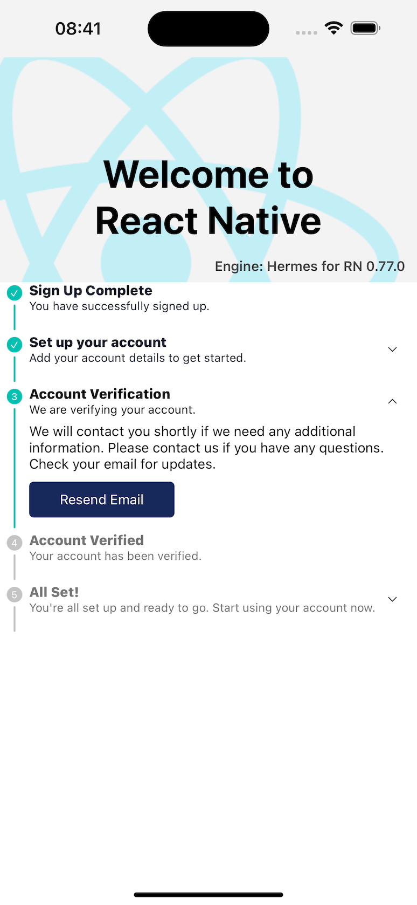

# react-native-vertical-status-progress

A component to show the progress of a process with different statuses. Works with Expo and React Native.

The `react-native-vertical-status-progress` component is designed to visually represent the progress of a multi-step process. Each step is represented by a status indicator that can be customized to show whether the step is completed or pending. This component is ideal for workflows, onboarding processes, or any scenario where you need to display progress through a series of steps.
It is compatible with both Expo and React Native projects, making it versatile and easy to integrate into your existing applications.

## Preview



## Features

- **Accordion Support**: Each status can be expanded or collapsed to show more details. This is useful for providing additional information or actions related to each step.
- **Customizable Content**: You can render any component within the accordion, including call-to-action (CTA) buttons, forms, or any other React Native components.

## Installation

```sh
npm install react-native-vertical-status-progress
```

## Usage

```jsx
import VerticalStatusProgress from 'react-native-vertical-status-progress';

const statuses = [
  {
    title: 'Sign Up Complete',
    subtitle: 'You have successfully signed up.',
    status: 'registered',
  },
  {
    title: 'Set up your account',
    subtitle: 'Add your account details to get started.',
    renderContent: (
      <TouchableOpacity>
        <Text>vbireuvgbireubgireuf</Text>
      </TouchableOpacity>
    ),
    status: 'setting_up',
  },
  {
    title: 'Account Verification',
    subtitle: 'We are verifying your account.',
    renderContent: (
      <View>
        <Text>
          We will contact you shortly if we need any additional information.
          Please contact us if you have any questions. Check your email for
          updates.
        </Text>
        <TouchableOpacity
          style={{
            backgroundColor: colors.ACCENT_BLUE,
            padding: 10,
            borderRadius: 5,
            width: 150,
            alignItems: 'center',
            marginTop: 10,
          }}
        >
          <Text style={{ color: '#fff' }}>Resend Email</Text>
        </TouchableOpacity>
      </View>
    ),
    status: 'verifying',
  },
  {
    title: 'Account Verified',
    subtitle: 'Your account has been verified.',
    status: 'waiting',
  },
  {
    title: 'All Set!',
    subtitle:
      "You're all set up and ready to go. Start using your account now.",
    renderContent: (
      <View>
        <Text>
          Lorem ipsum dolor sit, amet consectetur adipisicing elit. A ullam
          assumenda obcaecati? Minima libero vitae ducimus, omnis, excepturi
          saepe, doloribus corrupti hic deleniti id iure? Qui consequuntur at
          magnam consequatur!
        </Text>
      </View>
    ),
    status: 'ready',
  },
];

const App = () => {
    return (
        <VerticalStatusProgress statuses={statuses} />
    );
};

export default App;
```
See example for more.

## Props

| Prop                      | Type                                                                 | Default | Description                                                                 |
|---------------------------|----------------------------------------------------------------------|---------|-----------------------------------------------------------------------------|
| `statuses`                | `Status[]`                                                         | -       | An array of status objects containing title, subtitle, status, and optional renderContent. |
| `currentStatus`           | `string`                                                             | -       | The current status to be highlighted.                                       |
| `showLastStick`           | `boolean`                                                            | `false` | Whether to show the last stick or not.                                      |
| `statusColors`            | `StatusColors`                                                       | -       | An object defining the colors for different status stages. Example: `{ prevBallColor: 'red', currentBallColor: 'green', futureBallColor: 'blue', prevStickColor: 'red', currentStickColor: 'green', futureStickColor: 'blue', prevTitleColor: 'red', currentTitleColor: 'green', futureTitleColor: 'blue', prevSubtitleColor: 'red', currentSubtitleColor: 'green', futureSubtitleColor: 'blue' }` |
| `showOrder`               | `boolean`                                                            | `false` | Whether to show the order of statuses in numerals.                                      |
| `accordion`               | `boolean`                                                            | `false` | Whether to enable accordion functionality.                                  |
| `openAccordionStatus`     | `boolean`                                                            | `false` | Whether the accordion for current status is open by default.                                   |
| `containerStyle`          | `ViewStyle`                                                          | -       | Style for the container view.                                               |
| `contentWrapperStyle`     | `ViewStyle`                                                          | -       | Style for the accordion content wrapper view.                                         |
| `contentHeaderStyle`      | `ViewStyle`                                                          | -       | Style for the content header view.                                          |
| `titleStyle`              | `TextStyle`                                                          | -       | Style for the title text.                                                   |
| `subTitleStyle`           | `TextStyle`                                                          | -       | Style for the subtitle text.                                                |
| `accordionTitleViewStyle` | `ViewStyle`                                                          | -       | Style for the accordion title view.                                         |
| `accordionChevronViewStyle`| `ViewStyle`                                                         | -       | Style for the accordion chevron view.                                       |
| `renderBall`              | `(label: Statuses, idx: number) => React.ReactNode`                  | -       | Function to render a custom ball component.                                 |
| `renderStick`             | `(label: Statuses, idx: number) => React.ReactNode`                  | -       | Function to render a custom stick component.                                |
| `renderChevron`           | `(open: boolean, index: number) => React.ReactNode`                  | -       | Function to render a custom chevron component.                              |

## Customization

You can customize the appearance of the `react-native-vertical-status-progress` component by passing in custom styles and render functions. Here are some examples:

### Custom Ball Component

```jsx
const renderCustomBall = (label, idx, isPrev, isFuture) => (
  <View style={{ backgroundColor: isPrev ? 'blue' : 'grey', width: 16, height: 16, alignItems: 'center', justifyContent: 'center', borderRadius: 4 }}>
    <Text style={{ color: 'white', fontSize: 10 }}>{idx}</Text>
  </View>
);

<VerticalStatusProgress
  statuses={statuses}
  renderBall={renderCustomBall}
/>
```

### Custom Stick Component

```jsx
const renderCustomStick = (label, idx, isPrev, isFuture) => (
  <View style={{ flex: 1, width: 5, backgroundColor: isPrev ? 'blue' : 'grey' }} />
);

<VerticalStatusProgress
  statuses={statuses}
  renderStick={renderCustomStick}
/>
```

### Custom Chevron Component

```jsx
const renderCustomChevron = (open, index) => (
  <Text>{open ? '-' : '+'}</Text>
);

<VerticalStatusProgress
  statuses={statuses}
  renderChevron={renderCustomChevron}
/>
```

## Example Project

For a complete example, check out the [example project](example/) in the repository. This project demonstrates how to use the `react-native-vertical-status-progress` component in a real-world application.

## Troubleshooting

If you encounter any issues while using the `react-native-vertical-status-progress` component, please check the [issues](https://github.com/your-repo/react-native-vertical-status-progress/issues) section on GitHub. You can also open a new issue if you don't find a solution to your problem.

## Changelog

See the [changelog](CHANGELOG.md) for a history of changes to this component.


## Contributing

See the [contributing guide](CONTRIBUTING.md) to learn how to contribute to the repository and the development workflow.

## License

MIT

---

Made with [create-react-native-library](https://github.com/callstack/react-native-builder-bob)
